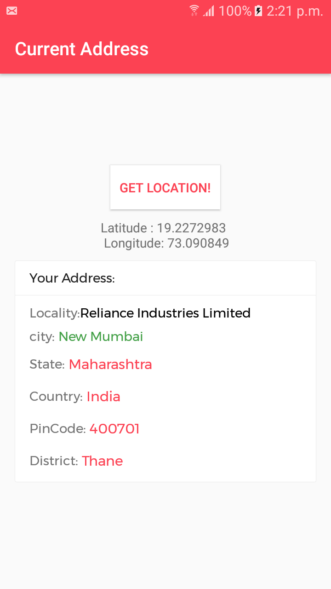

# Get-Current-Location-Address-using-latitude-and-longitude

 Dependency :
 
     implementation 'com.google.android.gms:play-services-location:17.0.0'

### Using getFusedLocationProviderClient get the Current Location 
- latitude-and-longitude 
- Current Address
- City
- State 
- Country
- Pincode 

